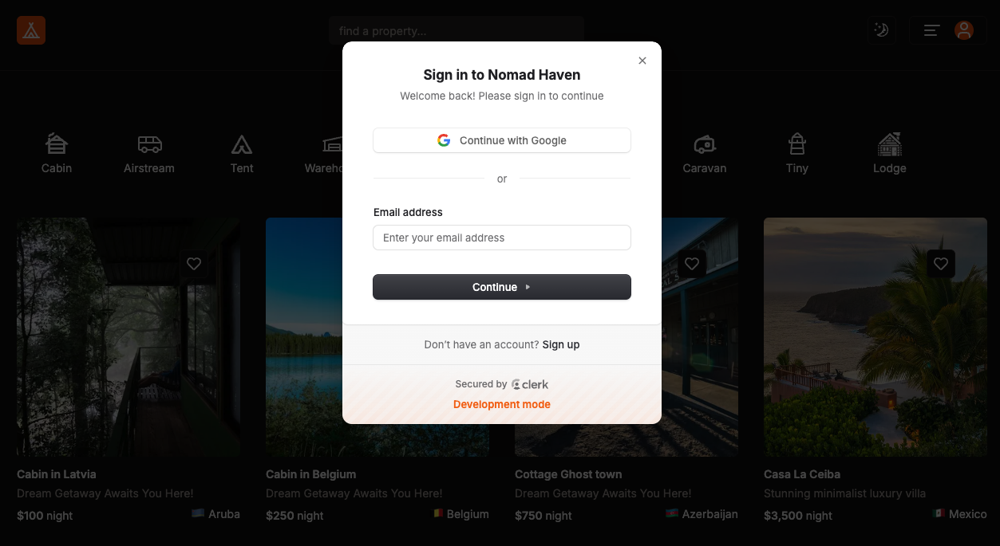
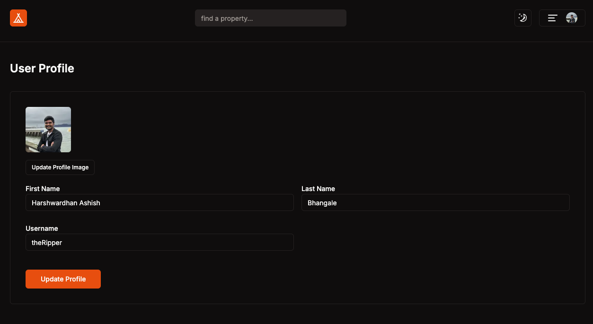
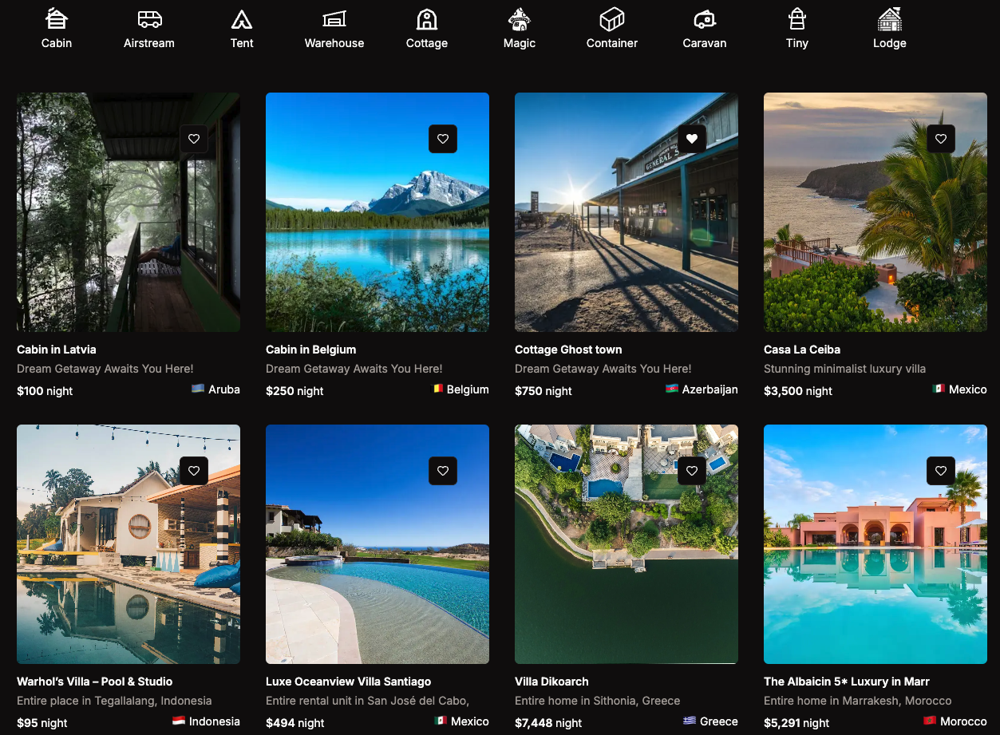
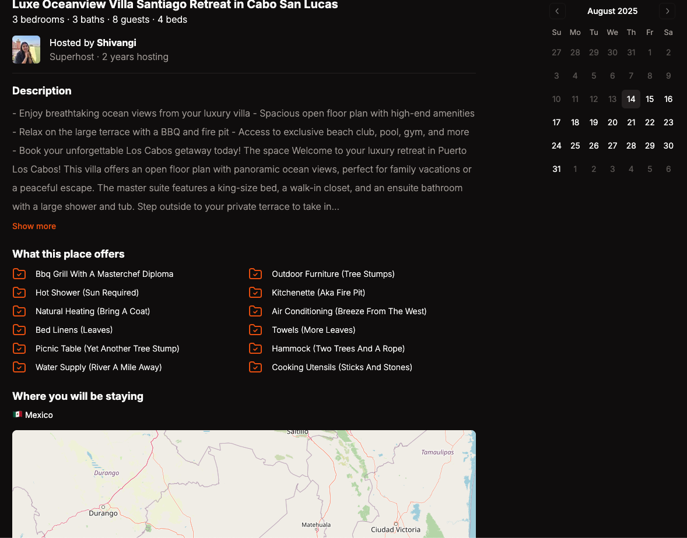
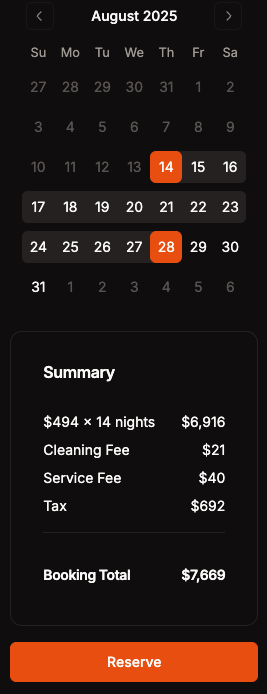
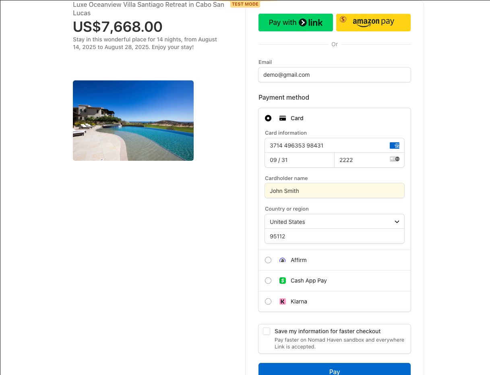
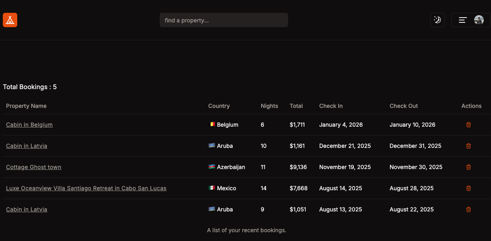
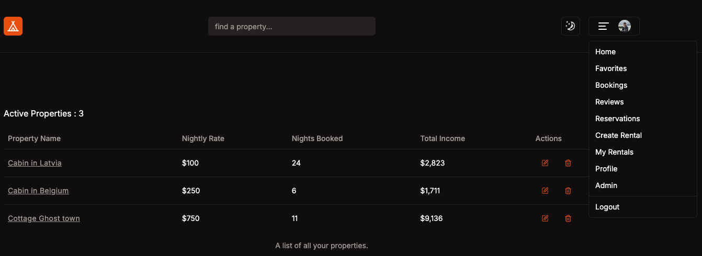
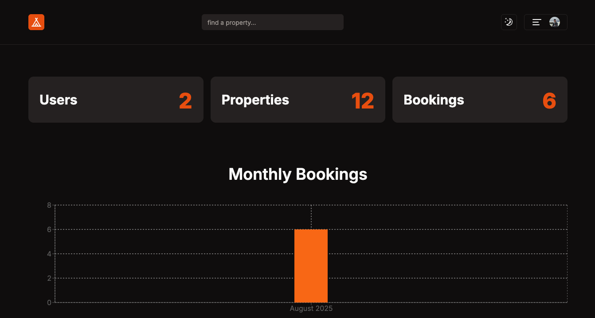

# Nomad Haven

Nomad Haven is a modern Airbnb-like rental platform that enables users to list, search, book, and manage rental properties. It features secure authentication, property CRUD operations, image management, category-based search, and **Stripe-powered** payments. Built with **Next.js 14** and **TypeScript**, backed by **Supabase (Postgres + Storage)**, and deployed on **Vercel**.

---

## Live Demo

[https://nomad-haven.vercel.app/](https://nomad-haven.vercel.app/)

---

## Screenshots & Features

> All screenshots should be placed in a `/screenshots` folder at the repo root with the exact filenames shown below.

---

### 1) Clerk Login
  
Secure authentication using **Clerk**, providing signup, login, and session management with email/password and third-party login options.

---

### 2) Profile / Update Profile
  
Users can update their display name, bio, and profile image. All updates are stored securely in **Supabase Postgres**.

---

### 3) Properties List
  
Browse all available properties with **category filters** and **search functionality** for quick discovery.

---

### 4) Property Detail Page
  
Displays detailed property information, amenities, location, pricing, and booking options.

---

### 5) Booking Calendar & Auto Total Rent Calculation
  
Interactive calendar to select check-in and check-out dates, with **automatic rent calculation** based on duration.

---

### 6) Stripe Checkout Page
  
Integrated **Stripe Embedded Checkout** for secure payment processing, automatically linked to the selected property and booking dates.

---

### 7) Bookings Tab (User’s Current Bookings)
  
Displays all active and past bookings for the logged-in user with status updates.

---

### 8) My Rentals (Properties I Posted)
  
List of properties added by the user for rent, with options to **edit** or **delete** each listing.

---

### 9) Admin Stats Dashboard
  
Admin view showing key platform stats: total properties, bookings count, and total booking revenue, with stat cards for quick insights.

---

## Key Features

- **Authentication & Authorization** with Clerk (protected routes, owner-only edits)
- **Property CRUD**: create, view, update, and delete listings with categories & amenities
- **Image Management** via Supabase Storage
- **Booking Flow** with date selection & auto total rent calculation
- **Stripe Payments** for secure online booking transactions
- **Search & Filtering** by category and keywords
- **Admin Dashboard** with aggregated stats

---

## Tech Stack

| Layer        | Tools |
|-------------|-------|
| Frontend    | Next.js 14 (App Router), React, TypeScript, TailwindCSS, shadcn/ui |
| Backend     | Next.js Server Components & Actions, Prisma ORM |
| Auth        | Clerk |
| Database    | Supabase Postgres |
| Storage     | Supabase Storage |
| Payments    | Stripe (Embedded Checkout) |
| Deployment  | Vercel |

---

## Getting Started (Local)

```bash
# 1) cd into 03-starter and Install dependencies
npm install

# 2) Setup environment variables (see below)
cp .env.example .env.local   # create and fill with your keys

# Clerk
NEXT_PUBLIC_CLERK_PUBLISHABLE_KEY=your_key
CLERK_SECRET_KEY=your_key

# Supabase
NEXT_PUBLIC_SUPABASE_URL=your_url
NEXT_PUBLIC_SUPABASE_ANON_KEY=your_anon_key
DATABASE_URL=your_supabase_db_url_with_pgbouncer
DIRECT_URL=your_supabase_direct_url

# Stripe
STRIPE_SECRET_KEY=your_stripe_secret
NEXT_PUBLIC_STRIPE_PUBLISHABLE_KEY=your_stripe_pk


# 3) Prisma setup
npx prisma generate
npx prisma db push

# 4) Run the app
npm run dev


